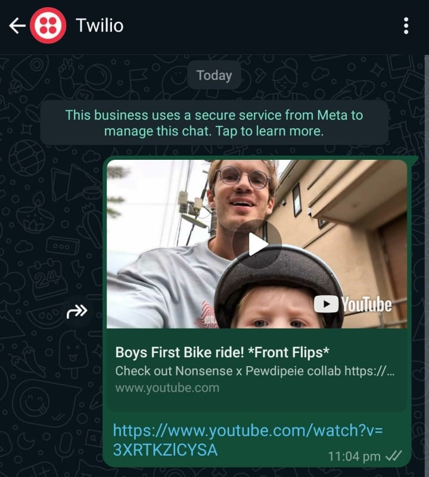

# habitica-task-youtube-vid
> [!IMPORTANT]
> [Habitica](https://habitica.com) is a productivity app that gamifies your tasks and habits. By turning your daily goals into a game, Habitica helps you stay motivated and productive. You can earn rewards and level up by completing tasks and building good habits.

When you complete the specified Habitica task, the script will send you a YouTube video as a reward. This integration utilizes webhooks, a containerized Flask server to process tasks and retrieve videos, and the Twilio WhatsApp API to send the message.

## Demo

> [!NOTE]  
> ***Why Develop This?***  - I’m into a YouTube channel that posts daily, but I’ve set up a system that keeps me off my computer from 10 p.m. to 6 a.m.  Since I can't access my computer during these hours, I developed a way to automatically send myself the video on WhatsApp as a reward for completing the task on Habitica like going for a walk.
>  
> Why WhatsApp, you might ask? The reason is that I already use WhatsApp for almost everything. Plus, it has this cool feature that lets you watch YouTube videos as a preview without needing a browser on your phone—which, if you haven’t guessed, I don’t have.
> <details>
> <summary>See WhatsApp Preview</summary>
> <br><br>
> </details>
> 

<p align="center">
  
</p>


## Installation
### Prerequisites

* Python 3.x
* ngrok (for creating tunnels to localhost)
* Docker (optional)

### Setup

1. Clone this repository to your local machine:
    ```bash
    git clone https://github.com/suffer-sami/habitica-task-youtube-vid/
    ```
2. Navigate to the project directory:
    ```bash
    cd habitica-task-youtube-vid/
    ```
3. Create and activate virtual environment:
    ```bash
    python -m venv venv
    source venv/bin/activate
    ```
4. Install the necessary dependencies:
    ```bash
    pip install -r requirements.txt
    ```
5. Set up the environment variables:
    - Copy the `.env.example` file to create a `.env` file.
    - Modify the `.env` file with your specific settings.

6. **Install ngrok:**
    - Download and install ngrok from [ngrok's website](https://ngrok.com/).
    - Connect your ngrok account by running the following command with your auth token:
      ```
      ngrok authtoken your_auth_token
      ```  
### Running the application
To run the application locally:
```bash
python run.py
```

To expose your local server to the internet using ngrok:
```bash
ngrok http 5000
```
- This will provide a URL that you can use as an endpoint for webhooks or for accessing your local server remotely.

#### Setting up a webhook with Habitica
After starting ngrok, copy the https URL provided by ngrok. Go to the Habitica website, navigate to [User Settings > Site Data](https://habitica.com/user/settings/siteData), and add your ngrok URL to the webhooks section to integrate with Habitica.

To run the application using Docker:
```bash
docker build -t habitica-task-youtube-vid .
docker run -p 5000:5000 habitica-task-youtube-vid
```

### Testing
1. **Install the testing tools:**
    ```bash
    pip install pytest pytest-cov pytest-mock
    ```
2. **Run the tests with coverage:**
    ```bash
    pytest --cov=app tests/
    ```

## Workflow
<p align="center">
  
</p>

## Potential Improvements:

1. **Reduce Retrieval Delay**: Currently, there is a slight delay in retrieving the video. To address this, I could implement a caching layer to store recently accessed videos and speed up the delivery process.

2. **Optimize WhatsApp API Usage**: The WhatsApp API has a limitation requiring the session to be refreshed every 24 hours. To maintain seamless functionality, I plan to automate the session refresh process, ensuring it remains active continuously.

3. **Implement Preemptive Threading**: If I complete a task before the YouTube video is uploaded, the system should initiate a thread that waits for the new video to be available. Once uploaded, this thread will automatically send me the video link.

## Contributing

Contributions are welcome! If you find any issues or have suggestions for improvements, feel free to open an issue or submit a pull request. If you need any help setting up automation, you can contact me.
