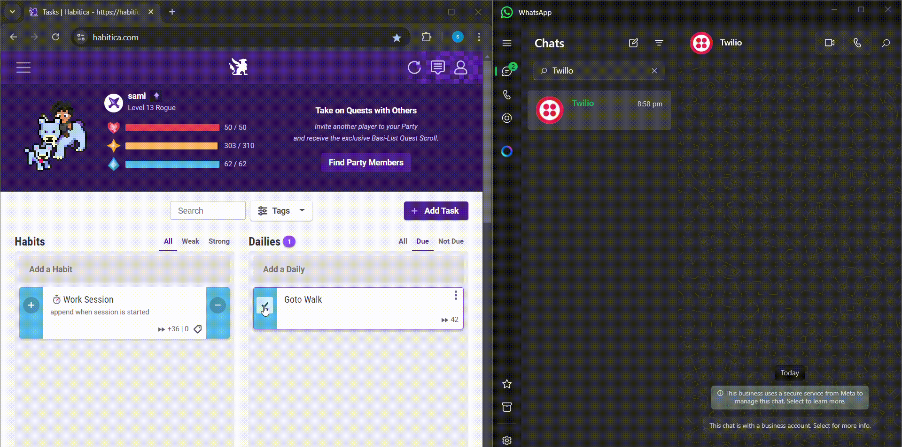
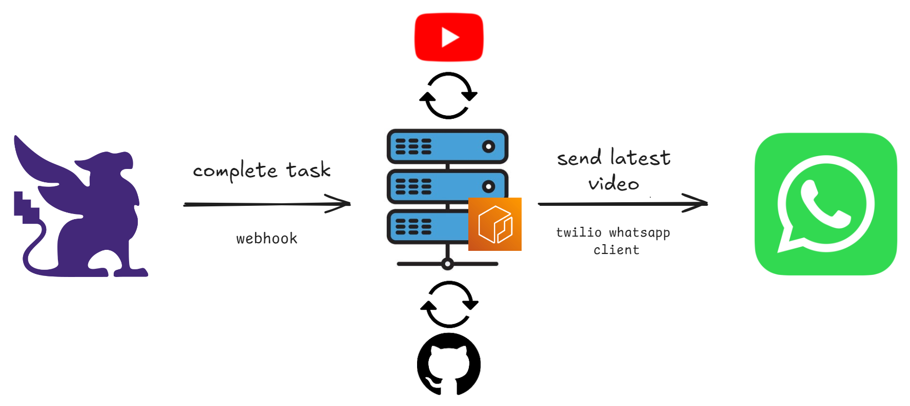

# habitica-task-youtube-vid

> [!NOTE]  
> ***Why Develop This?***  - I’m into a YouTube channel that posts daily, but I’ve set up a system that keeps me off my computer from 10 p.m. to 6 a.m. So, I developed a way to automatically send myself the video on WhatsApp as a reward for things like going for a walk.
>  
> Why WhatsApp, you might ask? The reason is that I already use WhatsApp for almost everything. Plus, it has this cool feature that lets you watch YouTube videos as a preview without needing a browser on your phone—which, if you haven’t guessed, I don’t have.

When you complete the specified Habitica task, the script will send you a YouTube video as a reward. This integration utilizes webhooks, a containerized Flask server to process tasks and retrieve videos, and the Twilio WhatsApp API to send the message.

## Demo

  

## Workflow

  

